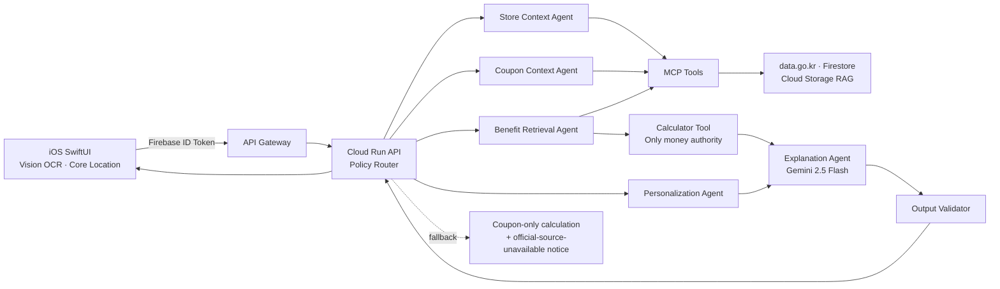

# 쿠폰콕 상용 AI 아키텍처

## 한 문장

쿠폰콕은 **위치 맥락에서 보유 쿠폰과 공식 혜택을 좁히고, 결정론적 계산 결과를 근거와 함께 설명하는 Responsible AI 서비스**다.

LLM은 할인 금액을 추정하거나 결제 결정을 대신하지 않는다. LLM의 역할은 구조화·검색 질의 구성·출처가 있는 설명이며, 금액·중복·순위의 최종 권한은 Calculator Tool 하나에 있다.

## 멀티에이전트 책임 분리

| 단계 | 주체 | 허용되는 일 | 금지되는 일 | 실패 시 |
|---|---|---|---|---|
| 0. 정책 라우팅 | Node API | Firebase 토큰 확인, 입력 범위·레이트 제한, 요청 ID 부여 | 추천 금액 생성 | 401/400으로 명확히 종료 |
| 1. 매장 맥락 | Store Context Agent | 수원 범위·지원 프랜차이즈 확인, 매장 후보 검색 | 쿠폰·사용자 식별자 전달 | MapKit/캐시 매장으로 제한 |
| 2. 쿠폰 맥락 | Coupon Context Agent | 브랜드·만료일·확인된 조건으로 후보 정리 | OCR 원문·바코드 재출력, 할인 조건 추정 | 확인 필요 상태로 사용자 편집 요청 |
| 3. 공식 혜택 검색 | Benefit Retrieval Agent | 통신사·등급·카드 상품명으로 공식 문서 RAG 검색 | 출처 없는 할인 금액 생성 | 쿠폰 단독 계산, ‘공식 근거 없음’ 고지 |
| 4. 사용 패턴 해석 | Personalization Agent | 동의된 브랜드별 사용 횟수·간격과 만료 위험 설명 | 원본 구매 이력 접근, 민감 속성 추론, 금액·순위 변경 | 개인화 문구 없이 가격 비교 유지 |
| 5. 가격 결정 | Calculator MCP Tool | 최종가·절약액·중복·순위를 코드로 계산 | LLM 판단 반영 | 계산 불가 사유와 조건을 반환 |
| 6. 설명·검증 | Explanation Agent + Validator | 계산 결과와 source URL을 사람이 이해할 문장으로 변환 | 금액·순위·근거 URL 변경 | 템플릿 설명으로 복귀 |

현재 ADK Sequential Agent는 Store→Coupon→Benefit→Personalization→Recommendation 실행 순서를 고정한다. MCP Tool은 read-only 계약만 노출하며, 개인화 이력 저장·삭제는 Agent가 아니라 앱·Repository 코드가 수행한다. 이 제한 자체가 에이전트의 권한 경계다.

## 모델 최적화 원칙

| 작업 | 모델/도구 | 설정 | 이유 |
|---|---|---|---|
| iPhone 이미지 OCR | Apple Vision | 기기 내 처리 | 원본 이미지를 서버로 보내지 않음 |
| OCR 텍스트 정규화 | Gemini 2.5 Flash | JSON 형식, 낮은 temperature | 빠른 구조화, 사용자가 저장 전 확인 |
| 공식 혜택 검색 | `gemini-embedding-001` + Cloud Storage index | 768차원, provider 필터 | 문장 유사도와 통신사/카드 일치 동시 보장 |
| 추천 설명 | Gemini 2.5 Flash | temperature 0, token budget 제한 | 계산 결과를 바꾸지 않는 짧고 일관된 설명 |
| 금액·순위 | TypeScript Calculator Tool | 순수 함수·단위 테스트 | 재현성·감사 가능성 |

비용이 큰 모델로 교체하는 기준은 ‘설명 선호도 향상’이 아니라, **출처 정확도·계산 일치율·P95 지연**의 개선이 수치로 확인될 때다.

## Responsible AI Guardrail

1. **입력 최소화**: 이미지·전체 바코드·카드번호·CVC·거래내역·Firebase UID를 Agent/MCP/AgentOps 입력에서 제외한다.
2. **도구 호출 전 검사**: 수원 좌표 범위, 반경 100~1,500m, 지원 통신사, 결제금액 1~1,000,000원, 쿠폰 최대 100장을 검증한다.
3. **출처-계산 분리**: RAG 문서에 구조화된 공식 규칙이 없는 경우, 해당 혜택은 링크로만 보여주고 가격에는 반영하지 않는다.
4. **출력 검증**: 설명의 절약액·최종가가 Calculator 결과와 다르면 폐기하고 템플릿 설명으로 대체한다.
5. **사용자 통제**: OCR 결과를 저장 전에 수정하고, 내 정보에서 기기 이미지와 Firestore 쿠폰·프로필·사용 기록을 모두 삭제할 수 있다.
6. **가용성**: ADK, RAG, AgentOps가 실패해도 쿠폰 단독 Calculator 추천은 중단하지 않는다.
7. **문서 거버넌스**: 공식 도메인, 검토일, staleAfter, 권리 판단, immutable version, SHA-256을 통과한 active 문서만 검색·계산에 사용한다.
8. **요청 격리**: ADK InMemory session은 요청마다 새로 만들어 다른 사용자의 쿠폰·프로필 상태가 다음 요청에 남지 않게 한다.

상세 법·보안·데이터 통제와 구현 추적성은 [`AI_LEGAL_SECURITY_DATA_COMPLIANCE.md`](AI_LEGAL_SECURITY_DATA_COMPLIANCE.md)를 따른다.

## 운영과 관측

| 계층 | 현재 기준 | 상용 승격 조건 |
|---|---|---|
| Cloud Logging/OpenTelemetry | 요청 ID, 도구명, 지연, 상태 코드 구조화 로그 | 원문 OCR·바코드·UID가 로그에 없음을 표본 점검 |
| ADK Eval | 도구 순서·가드레일·최종 응답 계약 테스트 | 대표 30개 시나리오에서 Calculator 일치율 100% |
| AgentOps | 선택 연동 코드만 준비됨 | API 키를 Secret Manager에 등록하고 개인정보 마스킹 검증 후 활성화 |
| 비용/품질 | Flash 토큰 예산, Cloud Run scale-to-zero | P95 3초 이내·오류율 1% 미만·일 예산 알림 |

### 현재 검증 증거

| 항목 | 구현 증거 | 검증 |
|---|---|---|
| 가격 권한 분리 | `calculator.ts`가 최대 할인액·중복·최종가를 결정하고, ADK 출력은 동일한 절약액/최종가가 아니면 폐기 | `npm test`의 percentage cap·ADK 설명 불변성 테스트 |
| Agent 장애 복구 | `shadow`/`explanation` ADK 호출 실패는 쿠폰 단독 계산을 유지하고 `agentRun.status=failed`로만 기록 | `npm test`의 shadow fallback 테스트 |
| 개인정보 최소화 | ADK payload와 Guardrail에서 OCR 원문·바코드·카드번호·UID를 차단 | ADK schema·guardrail 테스트, `user_reference` 해시화 |
| 운영 추적 | API가 UUID 요청 ID를 발급하고 Cloud Logging에 HTTP·도구 이벤트를 구조화 로그로 남김 | `x-couponcok-request-id` 계약 테스트 |
| 내부 서비스 인증 | ADK 요청마다 MCP Toolset을 새로 만들어 Cloud Run ID 토큰 만료를 회피 | `build_root_agent()` 구조 테스트, MCP는 private Cloud Run 유지 |
| 배포 안전성 | `cloudbuild.deploy.yaml`은 API candidate revision을 `--no-traffic`으로 배포 | 프로덕션 트래픽 전환은 수동 canary 명령만 허용 |
| CI | Node 계약 테스트, TypeScript build, Python 3.12 ADK guardrail test, API/MCP/ADK 이미지 build | Cloud Build `715ef60d-e7bb-4244-aa77-b306e578ff22` 성공 |

## 출시 단계

1. **Internal beta**: 수원·14개 프랜차이즈·익명 Firebase 인증. ADK는 `shadow` 모드로 실행해 사용자 응답을 바꾸지 않는다.
2. **Closed beta**: 20~50명에게 TestFlight 배포. 실제 권한 허용률, 매장 알림 탭 후 쿠폰 열기 성공률, 추천 신뢰도 설문을 측정한다.
3. **Limited release**: ADK 설명을 활성화하되, Calculator와 output validator는 그대로 유지한다. 통신사 문서는 운영자가 공식 링크·확인일·조건을 검수한 뒤에만 인덱스에 넣는다.
4. **Commercial expansion**: 지역과 브랜드를 하나씩 확장한다. 카드사는 카드번호 연동 대신 사용자가 상품명·실적 충족·남은 한도를 확인한 경우만 지원한다.

## 발표·평가용 스토리

> “처음에는 위치에서 쿠폰을 띄우는 앱을 만들었습니다. 하지만 상용 서비스라면 AI가 할인 금액을 그럴듯하게 만들어서는 안 된다는 문제를 발견했습니다. 그래서 쿠폰콕은 AI에게는 ‘찾고 설명하는 역할’만 주고, 금액은 검증 가능한 Calculator Tool이 결정하게 했습니다. 공식 근거가 없으면 할인으로 계산하지 않고, 사용자에게 확인이 필요하다고 말합니다. 멀티에이전트는 기능을 늘리기 위한 장식이 아니라, 개인정보·근거·계산 권한을 분리하기 위한 안전 구조입니다.”

개인 프로젝트 기여 증거는 다음 네 가지로 제시한다.

- iOS에서 OCR·위치·알림·쿠폰 이미지 보관과 사용자 흐름을 직접 구현한 화면/커밋
- Firebase 인증, API Gateway, private Cloud Run, 최소 권한 Service Account를 연결한 배포 구성
- ADK·MCP Tool 계약, Calculator 단위 테스트, guardrail/eval 결과
- 실제 레드팀 지적을 바탕으로 데모 데이터 분리·알림 복귀·권한 단계화·데이터 삭제를 개선한 전후 비교
