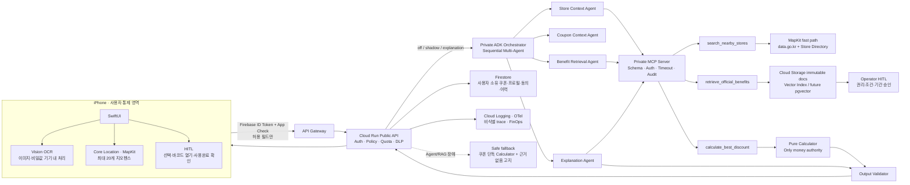
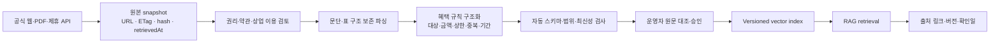
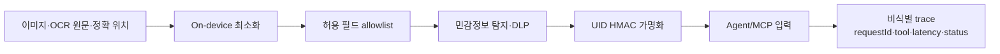

# 쿠폰콕 통합 Agentic AI 서비스 아키텍처·평가 블루프린트

- 문서 버전: 2026-08-20.v1
- 제품 범위: 수원 기반 iPhone MVP → 국내 프랜차이즈 혜택 의사결정 서비스
- 기준 저장소: `jhparktime/TicketCock`
- 상태 표기: **현재**(코드 존재) · **보강**(다음 구현) · **목표**(제휴·확장 단계)

## 0. 최종 결정

통합 결과물은 쿠폰을 모아두는 지갑이 아니라 다음 한 문장으로 정의한다.

> **쿠폰콕은 사용자가 매장에 도착한 순간, 보유 쿠폰과 공식 혜택을 검증 가능한 도구로 비교하고 근거를 설명하되, 최종 사용 결정은 사용자에게 남기는 초개인화 혜택 의사결정 에이전트다.**

구현의 중심은 `TicketCock`의 네이티브 iOS 경험이다. 다른 팀 구현의 장점은 다음처럼 흡수한다.

| 가져올 강점 | 통합 위치 | 채택 이유 |
|---|---|---|
| 네이티브 iOS, Vision OCR, Core Location, 알림, 바코드 UX | `CouponPilot` | 매장 진입이라는 핵심 사용 순간을 실제 iPhone에서 재현 |
| App Check, DLP, Model Armor, Golden Test, 사용자별 쿼터 | 보안·품질·FinOps 계층 | 상용 서비스의 오용·개인정보·비용 위험 통제 |
| ADK Tool 분리, Tool trace, RAG·Calculator 테스트 | `CouponPilotAgent`, 평가 패키지 | Agent의 행동과 결과를 재현 가능하게 평가 |
| PostGIS·pgvector·데이터 적재 계약 | 데이터 확장 단계 | 전국 매장과 대규모 공식 문서로 확장할 때 적용 |
| 단순한 혜택 온보딩과 상담 UX | iOS 프로필·설명 화면 | 사용자가 카드·통신사 조건을 쉽게 확인·수정 |

원칙은 **좋은 기능을 모두 한 번에 배포하지 않는 것**이다. 현재 Firestore·Cloud Storage 구조를 유지하고, 데이터량과 질의량이 기준을 넘을 때만 PostGIS·pgvector를 도입한다.

---

## 1. 사용자와 기업에 제공하는 결과물

### 1.1 사용자용 iOS 앱

1. 필수 처리와 선택 개인화·위치 동의를 분리한다.
2. 쿠폰·카드 이미지는 iPhone의 Vision으로 인식한다.
3. 카드번호·CVC·전체 바코드는 서버로 전송하지 않는다.
4. 주변 매장 진입 시 해당 브랜드에서 쓸 수 있는 후보만 좁힌다.
5. 공식 통신사·카드 문서가 검증된 경우에만 가격 비교에 반영한다.
6. Calculator가 최종가와 절약액을 결정한다.
7. AI는 추천 이유와 조건을 근거 링크와 함께 설명한다.
8. 사용자가 직접 쿠폰을 선택하고 바코드를 연다.
9. 결제 후 사용 완료 여부를 다시 확인하고 실행 취소를 제공한다.

### 1.2 기업·운영자용 혜택 지식 파이프라인

기업용 가치는 개인을 추적하는 것이 아니라 혜택이 선택으로 연결되는 과정을 개선하는 데 있다.

- 공식 혜택 문서의 변경·만료·철회를 버전으로 관리한다.
- 운영자가 원문과 구조화 규칙을 대조한 후에만 추천 인덱스에 승격한다.
- 비식별 집계로 `발견 → 노출 → 사용자 선택 → 사용 완료 확인` 퍼널을 제공한다.
- 향후 카드사·통신사 제휴 REST API는 공급자별 Adapter로 연결하고, Agent에는 동일한 MCP 계약으로 노출한다.
- 카드번호·거래내역·개인 이동 경로는 기업 분석 데이터에 포함하지 않는다.

### 1.3 제출·운영 산출물

| 결과물 | 경로/서비스 | 역할 |
|---|---|---|
| iOS 앱 | `CouponPilot` | OCR·위치·알림·쿠폰 선택·HITL |
| Public API | `CouponPilotBackend/src/server.ts` | Firebase/Auth/App Check, 정책·쿼터, fallback |
| Deterministic Engine | `CouponPilotBackend/src/calculator.ts` | 금액·중복·순위의 유일한 권한 |
| Benefit RAG | `CouponPilotBackend/src/benefitRag.ts` | 공식 혜택 검색·버전·권리·최신성 게이트 |
| MCP Server | `CouponPilotBackend/src/mcpServer.ts` | Agent와 Tool 사이의 표준 계약 |
| ADK Agent Service | `CouponPilotAgent` | 제한된 순차 멀티에이전트 실행 |
| Eval Package | `CouponPilotAgent/evals`, backend tests | 궤적·응답·RAG·계산·보안 회귀 평가 |
| CI/CD | `cloudbuild.yaml`, `cloudbuild.deploy.yaml` | 테스트, 이미지 빌드, shadow/canary 배포 |
| 운영 문서 | `CouponPilot/Docs` | 보안·데이터·평가·장애 대응 추적성 |

---

## 2. 목표 시스템 아키텍처



Apple은 한 앱이 동시에 감시할 수 있는 지리 조건을 20개로 제한하므로, 거리순 후보를 갱신하는 현재 전략을 유지한다. 시스템이 백그라운드에서 조건 변화를 전달할 수 있지만 재부팅 후에는 사용자가 기기를 한 번 잠금 해제해야 한다. 근거: [Apple Core Location 지역 모니터링](https://developer.apple.com/documentation/corelocation/monitoring-the-user-s-proximity-to-geographic-regions).

### 2.1 데이터 저장소 선택

| 데이터 | 1차 저장소 | 확장 조건 |
|---|---|---|
| 사용자 프로필·동의·쿠폰·사용 이력 | Firestore 사용자 소유 경로 | 관계형 조인이 필요해질 때만 별도 분석 저장소 사용 |
| 쿠폰 원본 이미지 | iPhone 앱 저장소 | 서버·Cloud Storage 업로드 금지 |
| 공식 혜택 원문·버전·해시 | Private Cloud Storage | 항상 immutable object로 보존 |
| 혜택 임베딩 | 현재 Cloud Storage index | 검증 문서 10만 청크 또는 검색 P95 500ms 초과 시 pgvector 검토 |
| 매장 디렉터리 | MapKit 즉시 검색 + data.go.kr/Firestore cache | 전국 확장·복합 공간 질의 증가 시 PostGIS 도입 |
| 비식별 이벤트·비용 | Cloud Logging → BigQuery | 원문·UID·정확 좌표 제외 |

Cloud SQL을 조기에 추가하면 Firestore와 이중 운영이 된다. **전국 매장, 다각형 상권, 수십만 문서**라는 실제 요구가 생길 때 PostGIS·pgvector를 함께 도입한다.

---

## 3. End-to-End 앱 서비스 파이프라인

| 단계 | 실행 주체 | 입력 | 처리 | 출력·실패 처리 |
|---|---|---|---|---|
| T1 동의·프로필 | iOS + Firebase | 필수·선택 동의 | policyVersion과 시각 저장 | 선택 거부 시 쿠폰 단독 모드 |
| T2 쿠폰·카드 등록 | Vision + 사용자 | 이미지 | 기기 OCR, 비밀 숫자 폐기, 구조화 초안 | 저장 전 사용자가 수정·확정 |
| T3 매장 진입 감지 | Core Location | 근거리 매장 20개 | 이탈 후 5분 재진입 규칙 | 권한 거부 시 수동 확인 |
| T4 매장 식별 | MapKit + Store Tool | 좌표·POI | 근접도·브랜드 정규화 | 복합몰·복수 후보는 사용자 선택 |
| T5 쿠폰 후보 선별 | 일반 코드 + Coupon Agent | 확인된 쿠폰 | 브랜드·만료·사용 상태 hard filter | 애매한 조건은 `확인 필요` |
| T6 공식 혜택 검색 | Retrieval Agent + RAG Tool | 매장·상품명·등급 | active·공식·최신 청크만 검색 | 근거 없으면 가격 계산 제외 |
| T7 가격 계산 | Calculator Tool | 금액·쿠폰·검증 규칙 | 순수 함수로 조합·상한·중복 계산 | 입력 불충분 사유 반환 |
| T8 설명·검증 | Explanation Agent + Validator | Calculator 결과·출처 | 짧은 근거 설명, 숫자 일치 검사 | 불일치 시 템플릿 설명 |
| T9 사용자 선택 | iOS HITL | 추천안·대안 | 사용자가 직접 선택 | 닫기·다른 혜택 선택 가능 |
| T10 바코드 표시 | iOS | 선택 쿠폰 | 기기 저장 이미지를 표시 | 자동 결제·자동 사용 금지 |
| T11 사용 완료 확인 | iOS HITL | 실제 결제 여부 | 명시적 확인 | 5초 실행 취소·기록 복원 |
| T12 기록·피드백 | Firestore + 비식별 집계 | 선택·취소·확인 | 개인 이력과 집계 이벤트 분리 | 개인화 철회 시 프로필·집계 연결 제거 |

### 3.1 HITL 두 종류

1. **사용자 HITL**: 추천은 읽기 전용이다. `이 쿠폰 사용하기`와 `사용 완료`는 반드시 사용자가 누른다. Agent가 쿠폰을 자동 소진하거나 결제 상태를 바꾸지 않는다.
2. **운영자 HITL**: 수집된 공식 문서는 초안 상태로 시작한다. 운영자가 대상·금액·상한·중복·기간·권리를 원문과 대조한 뒤에만 `active`로 승격한다.

이 경계는 MCP가 Tool 호출 시 사용자 통제·승인 UI를 제공하라고 권고하는 방향과 일치한다. 근거: [MCP Tool 안전 고려사항](https://modelcontextprotocol.io/specification/2024-11-05/server/tools).

---

## 4. 멀티에이전트 설계

### 4.1 Agent를 사용하는 이유

멀티에이전트는 기능 수를 늘리기 위한 장식이 아니라 **권한과 실패 범위를 분리하기 위한 구조**다.

| Agent | 맡는 판단 | 사용 Tool | 절대 금지 |
|---|---|---|---|
| Store Context Agent | 현재 POI·브랜드 후보의 맥락 정리 | `search_nearby_stores` | 쿠폰·프로필·바코드 접근 |
| Coupon Context Agent | OCR 확정값에서 애매한 조건 표시 | 기본은 Tool 없음 | 할인액 추정, 만료·사용 상태 우회 |
| Benefit Retrieval Agent | 공식 근거 검색 질의와 후보 분류 | `retrieve_official_benefits` | 출처 없는 규칙 생성 |
| Personalization Agent | 동의된 쿠폰 사용 이력 집계에서 방문 주기·만료 위험 해석 | 기본은 Tool 없음 | 원본 구매 이력 접근, 민감 속성 추론, 금액·순위 변경 |
| Explanation Agent | 계산 결과와 근거를 이해하기 쉽게 설명 | `calculate_best_discount` 결과 읽기 | 재계산, 순위·금액 변경 |

정책 라우터, 개인정보 검사, Calculator, Output Validator는 Agent가 아니라 코드다. 모델이 틀릴 수 있는 영역에 인증·가격·삭제·상태 변경 권한을 두지 않는다.

### 4.2 실행 형태

- **현재**: ADK `SequentialAgent`가 다섯 Agent의 순서를 고정한다.
- **보강**: 위치가 없는 요청에서는 Store Tool을 건너뛰는 조건부 경로를 명시한다.
- **보강**: 각 단계 출력에 JSON Schema와 `confidence`, `needsHumanReview`를 둔다.
- **목표**: 검색량이 증가하면 통신사·카드 Retrieval을 병렬 실행하되 Calculator 전에 합류한다.
- **금지**: Agent 간 무제한 대화, 자가 반복, 임의 웹 탐색, 결제·사용 완료 Tool 호출.

---

## 5. MCP와 Tool Calling 경계

MCP는 카드사·통신사 데이터 자체가 아니라 **Agent가 서로 다른 데이터·계산 기능을 같은 계약으로 호출하게 하는 표준 인터페이스**다. MCP 서버는 Resources, Prompts, Tools를 제공할 수 있으며 Tool은 모델이 호출하는 실행 함수다. 근거: [MCP 서버 기능 개요](https://modelcontextprotocol.io/specification/2025-06-18/server/index).

### 5.1 유지할 MCP Tool

| Tool | 성격 | 데이터 | 권한 |
|---|---|---|---|
| `search_nearby_stores` | read-only, open-world | 수원 좌표→매장 후보 | Store directory 읽기 |
| `retrieve_official_benefits` | read-only, closed-world | 검증된 통신사·카드 문서 | RAG active index 읽기 |
| `calculate_best_discount` | read-only, deterministic | 쿠폰·규칙→최종가·순위 | 외부 저장소 접근 없음 |

### 5.2 MCP로 노출하지 않을 작업

다음 작업은 모델이 결정하면 안 되므로 iOS 또는 인증된 REST API가 수행한다.

- 동의 저장·철회
- 쿠폰 저장·삭제
- 바코드 열기
- 사용 완료·복원
- 결제·포인트 차감
- 공식 문서 active 승격·철회

### 5.3 향후 공급자 Adapter

공식 카드사·통신사 MCP가 없어도 서비스 개발은 가능하다.

```text
통신사 공식 웹/PDF ─┐
카드사 제휴 REST API ├─ Provider Adapter ─ Normalized Benefit Schema ─ MCP Tool
가맹점 캠페인 Feed ─┘
```

외부 API가 생겨도 Agent 프롬프트와 Calculator 계약은 바꾸지 않고 Adapter만 교체한다. 각 Tool은 Zod/JSON Schema, 명시적 `outputSchema`, 입력 범위, timeout, rate limit, IAM, 구조화 오류를 가져야 한다. 정상·경계·인증 누락·타임아웃·잘못된 Tool 출력 계약을 CI에서 검사한다.

---

## 6. 공식 혜택 RAG 데이터 파이프라인



### 6.1 승격 조건

- 공식 provider-domain 관계가 확인됐다.
- 원문 snapshot과 SHA-256이 저장됐다.
- 수집·색인·파생·상업 이용 권리 판단이 `approved`다.
- `effectiveFrom <= effectiveTo`, 할인율 0~100, 금액·상한은 비음수다.
- 카드 규칙은 cardProductId, 매장 규칙은 eligibleStoreKeywords가 있다.
- `checkedAt <= now < staleAfter`다.
- 운영자가 원문 claim span과 구조화 규칙을 대조했다.

하나라도 실패하면 문서는 검색·Calculator에서 제외하고 링크 참고용으로도 `확인 필요`를 표시한다.

---

## 7. 개인정보 비식별화·보안 파이프라인



### 7.1 서버에 보내지 않는 데이터

- 쿠폰·카드 원본 이미지
- 카드번호·유효기간·CVC
- 전체 바코드·PIN·교환 URL
- Firebase UID 원문
- 장기 위치 이력·이동 경로
- 전체 결제·승인 내역

### 7.2 서버가 사용할 수 있는 최소 데이터

- 확인된 쿠폰 브랜드·상품·할인 구조·만료일
- 통신사·등급·월 사용 상태
- 카드사·상품 ID·사용자가 확인한 실적 충족·잔여 한도
- 현재 요청의 매장 ID와 범주화된 위치 맥락
- HMAC 기반 요청 주체 reference

자유 텍스트가 모델로 전달되기 전에는 Sensitive Data Protection inspect/de-identify template을 적용한다. 필요한 infoType만 지정해야 불필요한 지연과 비용을 줄일 수 있다. 근거: [Google Cloud Sensitive Data Protection 비식별화](https://docs.cloud.google.com/sensitive-data-protection/docs/deidentify-sensitive-data).

Firebase Auth는 사용자 인증, App Check는 정품 앱·기기 attestation이라는 서로 다른 경계다. enforcement 전에 모니터링 지표를 확인하고 점진적으로 켠다. 근거: [Firebase App Check](https://firebase.google.com/docs/app-check), [Apple App Attest 적용](https://firebase.google.com/docs/app-check/ios/app-attest-provider).

---

## 8. 정량 평가 설계

LLM Judge 하나로 합격 여부를 정하지 않는다. **코드 계약 → Tool 궤적 → RAG → 설명 → 시스템 → 사용자 행동** 순서로 평가한다.

### 8.1 평가셋 구성

Closed beta 전에는 최소 60개 골드 시나리오를 만들고, 상용 후보에서는 Agent trajectory 300개·RAG 질의 600개·합성 PII red-team 5,000개까지 단계적으로 확대한다. 작은 beta set은 빠른 PR 회귀 검사용이고, 큰 holdout은 prompt를 맞추는 데 사용하지 않는다.

| 묶음 | 최소 건수 | 포함 사례 |
|---|---:|---|
| Calculator | 20 | 정액·정률·최대할인·최소금액·중복·동률·0원 하한 |
| 매장·쿠폰 매칭 | 10 | 14개 브랜드 alias, 다른 브랜드, 복합몰 복수 후보 |
| RAG | 15 | 공식 근거, 근거 없음, stale, 철회, 카드 상품 불일치 |
| Agent trajectory | 10 | 좌표 있음/없음, RAG 실패, Calculator fallback |
| Security adversarial | 15 | 카드번호·바코드·UID·정확 위치·prompt injection·과다 Tool 호출 |

한 시나리오가 여러 묶음에 포함될 수 있다. 작성용 dev set과 최종 release holdout set을 분리한다.

상용 확대 세트에는 Calculator 수동 검증 400건과 속성 기반 경계값 10,000건, MCP 정상·비정상 계약 각 500건, 사용자 간 session canary 500쌍을 포함한다. 실제 사용자 카드·쿠폰 원문은 평가 데이터로 재사용하지 않고 합성 데이터와 테스트 번호를 사용한다.

### 8.2 출시 지표와 기준

| 계층 | 지표 | Internal beta | Limited release |
|---|---|---:|---:|
| Calculator | 최종가·절약액 Exact Match | **100%** | **100%** |
| Coupon filter | 만료·사용완료·타 브랜드 제외율 | **100%** | **100%** |
| MCP contract | 유효 schema 성공·무효 입력 거부 | **100%** | **100%** |
| Tool trajectory | 필수 Tool 순서 준수 | ≥98% | **100% holdout** |
| RAG | Recall@5 | ≥90% | ≥95% |
| RAG | 숫자·조건 citation precision | ≥98% | **100%** |
| RAG | stale/retired 문서 선택 | **0건** | **0건** |
| 설명 | Calculator 숫자 일치 | **100%** | **100%** |
| 설명 | 근거 없는 신규 혜택·조건 생성 | ≤1% | **0% holdout** |
| 개인정보 | 민감 필드 Agent/MCP/trace 유출 | **0건** | **0건** |
| 위치 | 지원 매장 Top-1 식별 정확도 | ≥90% | ≥95% |
| 성능 | 추천 API P95 | ≤4초 | ≤3초 |
| 신뢰성 | 5xx 비율 | <2% | <1% |
| 비용 | 월 베타 총액 | ≤100,000원 | 승인 예산 내 |

Hard Gate인 Calculator 오류, PII·사용자 간 누출, 승인 없는 상태 변경, 비공식·만료 규칙 실행, 인증 우회는 평균 점수로 상쇄하지 않는다. 한 건이라도 발생하면 승격을 중단한다.

### 8.3 ADK Eval 적용

현재 `tool_trajectory_avg_score=0.5`, `response_match_score=0.6`은 시연 단계 기준이다. 상용 승격 시 다음처럼 강화한다.

- 필수 경로는 `EXACT` 또는 threshold 1.0을 사용한다.
- 선택 Tool이 개입할 수 있는 경로는 `IN_ORDER`로 필수 순서만 보장한다.
- 표현 다양성은 ROUGE만 사용하지 않고 `final_response_match_v2`와 rubric 평가를 보조로 사용한다.
- `hallucinations_v1`, `safety_v1`을 nightly 평가에 추가한다.
- 금액 정확성·PII 유출은 LLM 평가가 아니라 deterministic assertion으로 판정한다.
- 확률적인 Agent 케이스는 최소 3회 반복하고 성공률과 95% 신뢰구간을 함께 기록한다.

ADK는 Tool trajectory, response match, rubric, hallucination, safety 평가 기준을 제공하며, 빠른 CI에는 trajectory·response match를 권장한다. 근거: [Google ADK 평가 문서](https://adk-labs.github.io/adk-docs/evaluate/), [ADK trajectory match 구현](https://github.com/google/adk-python/blob/main/src/google/adk/evaluation/trajectory_evaluator.py).

---

## 9. 정성 평가 설계

### 9.1 사용자 평가

- 대상: 수원에서 프랜차이즈를 이용하고 쿠폰·통신사 혜택을 보유한 iPhone 사용자 8명 이상
- 환경: 실기기, 일반 거리 매장과 복합몰·고층 매장을 각각 포함
- 과업: 동의 → 쿠폰 등록 → 위치 권한 → 알림 탭 → 추천 이해 → 바코드 열기 → 사용 완료/복원
- 측정: 성공 여부, 결정 시간, 오류 회복, 5점 Likert, 인터뷰

| 질문 | 목표 |
|---|---:|
| 추천 이유를 한 번에 이해했다 | 평균 ≥4.0/5 |
| 계산 결과를 신뢰할 수 있었다 | 평균 ≥4.0/5 |
| 최종 선택권이 나에게 있다고 느꼈다 | 평균 ≥4.3/5 |
| 개인정보 수집 범위를 이해했다 | 정답률 ≥80% |
| 알림이 방해가 됐다 | 평균 ≤2.5/5 |
| 핵심 과업 성공률 | ≥90% |
| 추천 확인 후 선택까지 중앙값 | ≤15초 |

관찰 메모는 `발견성`, `이해`, `신뢰`, `통제`, `개인정보`, `위치오류` 코드로 분류한다. 두 명이 코딩할 경우 불일치를 합의 조정하고 Cohen's kappa 0.7 이상을 목표로 한다.

### 9.2 기업·운영자 평가

혜택 운영, 보안·개인정보, 마케팅 담당자 각 1명 이상에게 다음을 검증한다.

- 공식 문서 한 건을 active로 승격하는 데 필요한 시간이 10분 이내인가.
- 원문·규칙·버전·철회 이력을 추적할 수 있는가.
- 비식별 퍼널이 혜택 개선 의사결정에 충분한가.
- 개인 원문 없이도 캠페인 성과를 설명할 수 있는가.
- 잘못된 혜택을 15분 안에 retire하고 검색에서 제거할 수 있는가.

### 9.3 평가 편향 방지

- 개발자가 사용법을 설명하지 않는 첫 시도와 설명 후 재시도를 분리한다.
- 데모 시나리오와 실제 사용자가 보유한 쿠폰 시나리오를 분리한다.
- 성공 사례만 영상으로 남기지 않고 실패·거부·권한 철회도 기록한다.
- LLM Judge 결과의 10% 이상을 사람이 원문과 대조한다.

---

## 10. CI/CD·AgentOps·FinOps 파이프라인

```mermaid
flowchart LR
    PR["Pull Request"] --> STATIC["lint · type · secret scan"]
    STATIC --> UNIT["Calculator · schema · guardrail"]
    UNIT --> OFFLINE["offline eval\ntrajectory · RAG fixtures"]
    OFFLINE --> BUILD["API · MCP · ADK images"]
    BUILD --> STAGE["staging deploy"]
    STAGE --> LIVE["live ADK/RAG eval"]
    LIVE --> SHADOW["shadow 10%"]
    SHADOW --> CANARY["canary 5% → 25% → 50%"]
    CANARY --> PROD["production"]
    PROD --> MON["quality · privacy · latency · cost"]
    MON -. "gate failure" .-> ROLLBACK["ADK off + previous revision"]
```



### 10.1 실행 주기

| 시점 | 필수 검사 |
|---|---|
| 모든 PR | TypeScript/Python/Swift build, Calculator, MCP schema, PII guardrail, offline eval |
| main merge | 컨테이너 빌드, 취약점·Secret scan, staging smoke test |
| nightly | live ADK eval, RAG holdout, hallucination/safety, 공식 URL·stale 점검 |
| 혜택 문서 변경 | source hash·rights·rule·retrieval 회귀, 운영자 승인 |
| 출시 전 | 실기기 위치·알림·OCR·동의·삭제, shadow/canary 기준 확인 |

### 10.2 AgentOps/관측 필드

허용 필드만 추적한다.

- requestId, environment, revision
- agentName, modelVersion, promptVersion
- toolName, sequenceIndex, status, durationMs
- input/output token 수, cache hit, retrieval 후보 수
- validator pass/fail reason code
- fallback 여부, 사용자 선택 유형의 비식별 집계

금지 필드: OCR 원문, 바코드, 카드번호, UID, 정확 좌표, 전체 Tool payload, 자유 텍스트 프롬프트. AgentOps 키가 없거나 추적이 실패해도 추천 경로는 계속 동작한다.

### 10.3 FinOps 통제

- `Gemini Flash → 템플릿 fallback` 순으로 비용을 제한한다.
- RAG 임베딩은 ingest 시 한 번 수행하고 runtime은 read-only로 운영한다.
- shadow는 request ID 기반 10% 표본만 실행한다.
- 사용자별 OCR·추천·검색 쿼터를 둔다.
- 매장 디렉터리와 공식 검색 결과를 버전 키로 캐시한다.
- Cloud Run은 beta에서 min 0, API max 3, MCP·ADK max 2를 유지한다.
- 50%·80%·100% 예산 알림과 feature flag를 연결하되 자동 차단은 운영자 승인을 거친다.

---

## 11. 최소 권한 서비스 계정

| 계정 | 허용 | 금지 |
|---|---|---|
| API Gateway SA | API Cloud Run invoke | Firestore·Storage·Secret 직접 접근 |
| API Runtime SA | Firebase/Admin 검증, 사용자 Firestore 경로, 지정 Secret | IAM 변경·원문 RAG ingest |
| ADK Runtime SA | Vertex AI, MCP Cloud Run invoke, 지정 Secret | Firestore·Storage 직접 읽기 |
| MCP Runtime SA | Store cache 읽기, RAG object viewer, 지정 API secret | 사용자 데이터 쓰기·문서 승격 |
| Benefit Ingest SA | 공식 문서 bucket write, index candidate write | 사용자 Firestore·production traffic 변경 |
| Benefit Reviewer SA | candidate→active 승인·retire | 사용자 데이터·AI runtime 호출 |

Owner·Editor 기본 역할은 사용하지 않는다. 서비스 간 호출은 Cloud Run IAM ID Token을 기본으로 하고 내부 토큰은 추가 방어 또는 로컬 개발에만 사용한다.

---

## 12. 단계별 통합 로드맵

### Phase 0 — 공개 저장소 정합성

- 현재 로컬 ADK·MCP·동의·카드 OCR 변경을 별도 브랜치에 정리한다.
- build·test를 통과한 커밋만 GitHub에 푸시한다.
- README의 현재 구현과 배포 상태를 코드와 일치시킨다.

### Phase 1 — Closed beta 필수선

- App Check monitor → enforce 단계화
- HMAC 가명화와 DLP/로컬 정규식 이중 검사
- 사용 완료 5초 undo·기록 복원
- 최소 60개 골드 평가셋
- `tool_trajectory_avg_score` 상향
- 8명 실기기 사용자 평가

### Phase 2 — 공식 혜택 운영

- 카드·통신사 문서 candidate/active/retired workflow
- 운영자 승인 UI 또는 검증 CLI
- RAG Recall@5·citation precision 대시보드
- 공식 혜택 최소 3개 통신사 × 핵심 10개 브랜드 확보

### Phase 3 — 데이터 확장

- 수원 전역 매장 품질 측정
- 전국 확장 시 PostGIS store directory 도입
- 문서 규모·지연 기준 충족 시 pgvector 전환
- 공급자별 Partner Adapter와 normalized schema

### Phase 4 — 상용 운영

- TestFlight → App Store 심사
- SLO·사고 대응·데이터 삭제 SLA
- 기업용 비식별 퍼널과 공식 피드 제휴
- 지역·브랜드·제휴사를 canary로 순차 확대

---

## 13. 1차 통합 구현 결과

2026-08-20에 TicketCock 중심으로 다른 저장소의 P0 장점을 다음처럼 선택 이식했다.

| 항목 | 구현 결과 | 검증 |
|---|---|---|
| 사용자 HITL | 사용 완료 후 5초 undo, 기록 상세 복원, 레거시 기록 fail-closed | iOS Debug build |
| Firestore 상태 이동 | active↔used 문서를 batch로 양방향 이동, 오프라인 복원 tombstone | iOS Debug build |
| 기기 선제 비식별화 | OCR의 바코드·전화·이메일·식별번호를 서버 요청 전 제거 | Swift compile |
| 서버 이중 비식별화 | OCR 자유 텍스트 재검사·redaction, Agent payload 값 검사 | API contract test |
| 사용자 가명화 | Firebase UID 대신 환경별 HMAC reference | deterministic test |
| MCP 계약 | 3개 Tool의 strict input·명시적 output schema·인증·오류 계약 | MCP contract test |
| Agent privacy guardrail | PAN/Luhn, 긴 바코드, 전화, 이메일, UID형 값 차단 | red-team 14/14 |
| 정성 평가 | 계산 충실도·출처·불확실성·사용자 통제·개인정보·행동성 rubric | JSON/schema test |
| 회귀 파이프라인 | `npm test`가 API와 MCP 테스트를 모두 실행 | Node tests pass |
| Closed-beta 골드셋 | Calculator 22·매장 매칭 14·RAG 거버넌스 10·PII 14 | deterministic 60/60 |
| 혜택 운영자 HITL | `candidate` 제출 → 다른 검토자의 `approve` → active index, retire tombstone | CLI·TypeScript build |
| 공공 매장 데이터 계보 | data.go.kr 데이터셋 ID·공식 URL·API 버전·갱신 정책을 REST/MCP 결과에 포함 | MCP contract test |

아직 완료로 표시하지 않는 항목은 다음과 같다.

- Google Sensitive Data Protection 실제 inspect/de-identify template 호출
- Model Armor production floor와 AgentOps 실제 키 활성화
- release holdout·실제 ADK trajectory 10개 이상과 상용 규모 holdout
- Swift 단위·UI Golden Test target
- TestFlight 실기기 현장 GPS·권한·알림 검증
- 공식 혜택 운영자 승인 UI와 최소 3사 × 10개 브랜드 데이터
- 데이터 규모 기준 충족 후 PostGIS·pgvector 전환

---

## 14. Definition of Done

통합 결과물이 완성됐다고 말하려면 다음을 모두 충족해야 한다.

- [ ] iPhone 실기기에서 동의→OCR→위치→알림→추천→바코드→사용완료→복원이 동작한다.
- [ ] Agent·RAG 장애 시 쿠폰 단독 Calculator가 동작한다.
- [ ] Calculator 20개 이상 fixture의 금액 Exact Match가 100%다.
- [ ] 최소 60개 eval 시나리오와 별도 release holdout이 있다.
- [ ] 필수 Tool 궤적과 MCP 계약 테스트가 출시 기준을 통과한다.
- [ ] stale·retired·출처 미확인 문서가 가격 계산에 0건 반영된다.
- [ ] 카드번호·바코드·UID·정확 좌표가 Agent/MCP/trace에 0건 노출된다.
- [ ] 사용자가 모든 개인 데이터를 앱에서 삭제할 수 있다.
- [ ] 8명 이상 실기기 평가에서 과업 성공률 90% 이상이다.
- [ ] P95 지연, 오류율, 월 비용이 설정한 기준 안에 있다.
- [ ] 최소 권한 서비스 계정과 Secret Manager 주입이 배포 구성에 반영됐다.
- [ ] GitHub README·아키텍처·실제 배포 버전이 일치한다.

이 기준을 만족하면 쿠폰콕은 “AI를 붙인 쿠폰 데모”가 아니라, **멀티에이전트의 행동·도구·근거·개인정보·비용을 측정하고 통제할 수 있는 Full-stack Agentic AI 서비스**로 설명할 수 있다.
